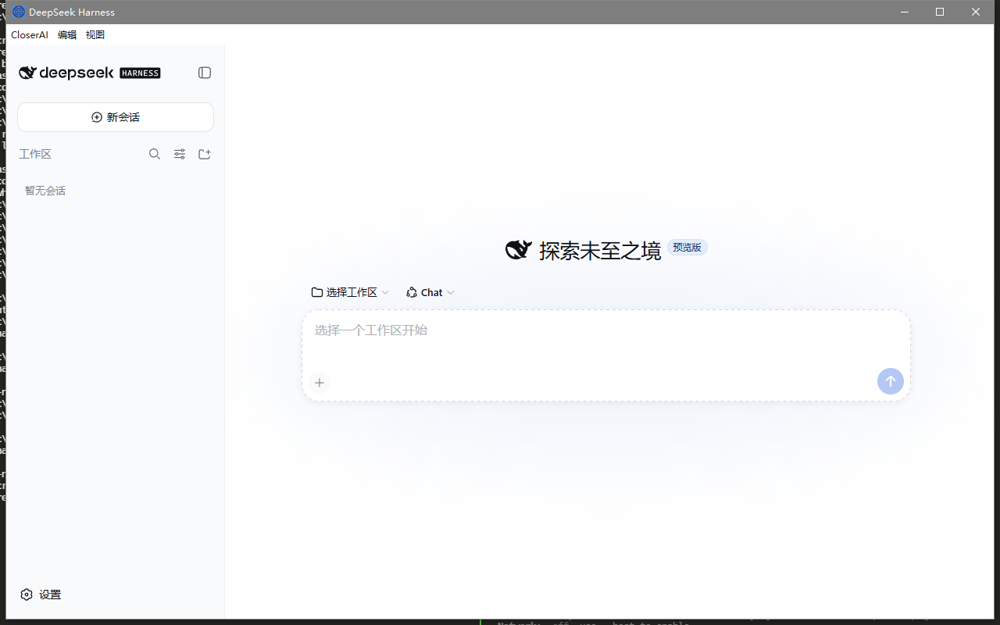

# CloserAI

> 本地优先、模型无关、权限透明的开源桌面 AI 工作台，用于交付真实的 Chat + Work +
> Code/Cowork 成果。**基于 DeepSeek Harness 构建。**

[English](README.md) · [简体中文](README.zh.md)


<p align="center">
  
</p>

CloserAI 是一款开源桌面应用，在加固的 Electron 外壳中托管一个
[DeepSeek Harness](https://github.com/deepseek-ai/deepseek-harness) 进程。它不是简单套壳：在保留
DSH 作为 Agent 运行时的同时，新增了桌面监督器（Supervisor）、三种权限隔离工作模式
（Chat / Work / Code）、本地优先的会话存储、基于系统钥匙串的密钥管理，以及插件安全模型。

## ✨ 核心特性

- **加固外壳** —— 上下文隔离、沙箱、严格 CSP、导航锁定、单实例、深链。
- **三种权限隔离模式** —— Chat / Work / Code，让模型只能拿到它该拿的工具与文件。
- **本地优先的会话** —— 所有对话持久化在 `DSH_HOME` 下，支持历史、项目、导出/导入与重启恢复。
- **原生桌面** —— 系统托盘、崩溃/恢复通知、开机启动。
- **透明设计** —— 管理页展示能力开关、各模式权限清单与脱敏诊断日志。
- **模型无关** —— 支持 DeepSeek、任意 OpenAI 兼容接口，以及完全离线的 **Mock 模式**（无需密钥）。

## 🚀 快速开始

**方式 A —— 安装 Windows 版（推荐）**

1. 下载 [CloserAI-0.1.0-Setup-x64.exe](https://github.com/sb1733831438-maker/DSH-closerAI/releases/latest)。
2. 用 `SHA256SUMS.txt` 校验 SHA-256（Windows：`Get-FileHash -Algorithm SHA256 .\CloserAI-0.1.0-Setup-x64.exe`）。
3. 运行安装包，启动后选择 **Mock 模式** 即可零配置体验。

> 安装包尚未代码签名——若 SmartScreen 提示，请选择「更多信息 → 仍要运行」，并以校验和为准。
> 详见 [docs/TROUBLESHOOTING.md](docs/TROUBLESHOOTING.md)。

**方式 B —— 从源码运行**

```bash
pnpm install
pnpm check          # 格式化 + 检查 + 构建 + 类型检查 + 测试
pnpm smoke          # 端到端：引导 → DSH UI → 管理页
cd apps/desktop && pnpm run dev
```

需要 Node.js >= 20.19 与 pnpm 11。DSH 在 lockfile 中固定了精确运行时版本。

## 🧩 模式

| 模式     | 能做                               | 不能做              |
| -------- | ---------------------------------- | ------------------- |
| **Chat** | 联网搜索、附件（只读）             | Shell、本地文件访问 |
| **Work** | 应用私有沙箱内处理文档             | Shell、访问沙箱外   |
| **Code** | 指定目录、shell/git/终端（需批准） | 未经批准访问目录外  |

可通过托盘或管理页切换模式；每个项目固定一种模式 + 工作目录，并在重启后恢复。

## 🛠 开发

```bash
git clone https://github.com/sb1733831438-maker/DSH-closerAI.git
cd DSH-closerAI
pnpm install
pnpm check
cd apps/desktop
pnpm run pack     # 构建 Windows 安装包（release/CloserAI-*-Setup-x64.exe）
```

新增功能必须保持 `pnpm check` 全绿（120 项测试）与 `pnpm smoke` 通过。扩展模式/预设请参考
[docs/PLUGIN_DEV.md](docs/PLUGIN_DEV.md)。

## 📚 文档

- [用户手册 (中文)](docs/USER_MANUAL.zh.md) · [User manual (EN)](docs/USER_MANUAL.md)
- [排障指南](docs/TROUBLESHOOTING.md)
- [架构](docs/ARCHITECTURE.md) · [决策记录](docs/DECISIONS.md) · [状态](docs/STATUS.md) · [执行计划](docs/EXECUTION_PLAN.md)
- [第三方声明](THIRD_PARTY_NOTICES.md) · [安全策略](SECURITY.md) · [贡献指南](CONTRIBUTING.md)

## 🗺 里程碑

| 版本       | 范围                                                       | 状态       |
| ---------- | ---------------------------------------------------------- | ---------- |
| v0.0.1     | monorepo、工具链、Mock Provider、CI                        | 已发布     |
| v0.0.2     | 桌面外壳：DSH 监督器 + 加固 Electron 窗口                  | 已发布     |
| v0.0.3     | 首次引导、钥匙串密钥、DeepSeek/OpenAI 兼容 + Mock Provider | 已发布     |
| v0.0.4     | Chat / Work / Code 权限隔离模式                            | 已发布     |
| v0.0.5     | 日常对话：会话、历史、项目、文件处理                       | 已发布     |
| v0.0.6     | 扩展与 Web：能力开关、诊断、权限清单                       | 已发布     |
| v0.0.7     | 原生桌面：托盘、通知、开机启动                             | 已发布     |
| v0.0.8     | 首个 Windows 安装包 + 打包运行时修复                       | 已发布     |
| v0.0.9     | RC 硬化：声明、安全与健壮性测试、手册                      | 已发布     |
| **v0.1.0** | **可日常使用：Windows 安装包 + 校验和**                    | **已发布** |

## 📄 许可证

[MIT](LICENSE) © CloserAI 贡献者。CloserAI 不 Fork、不修改 DeepSeek Harness 核心，仅将其作为
Agent 运行时托管。
